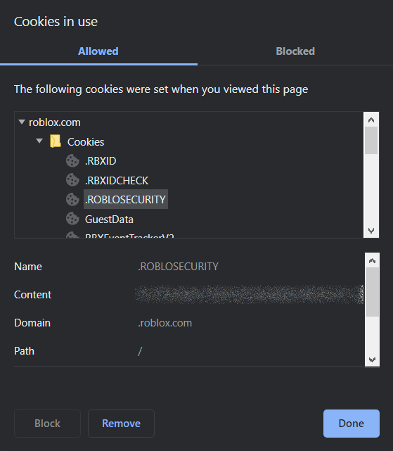

Authentication is required for accessing the majority of resources on Roblox. Authentication can usually be granted with
a cookie such as the `.ROBLOSECURITY` cookie. It will allow us to send API requests as a logged-in user, which will enable
you to write bots that can modify content on the Roblox platform (for example, ranking a user in a group). To do this, we
need to get our .ROBLOSECURITY cookie.

## .ROBLOSECURITY

The .ROBLOSECURITY token is placed in the client's cookies and identifies the user's active session. The cookie must be named .ROBLOSECURITY and contains a value similar to this:

    _|WARNING:-DO-NOT-SHARE-THIS.--Sharing-this-will-allow-someone-to-log-in-as-you-and-to-steal-your-ROBUX-and-items.|_TOKEN

The TOKEN is a capitalized hexadecimal string, roughly around 600 characters in length.

!!! danger
    You may have heard of this token before and have been told that you should never, under any circumstances, share
    this token with anyone - and this is true! This token does give an attacker access to your Roblox account. However,
    this doesn't mean they gain access to _everything_ - over time, more and more things are being locked behind other
    verification methods, like 2-step verification. We recommend using an alternate account with only the permissions it
    needs to limit the destruction an attacker can do. [Always enable 2-step verification!](https://en.help.roblox.com/hc/articles/212459863)

### Obtaining the cookie

To grab your .ROBLOSECURITY cookie, log into your account on the Roblox website and follow the instructions below.

!!! warning
    Pressing the "Log out" button on the Roblox website invalidates your token, so you should not press this button
    after grabbing your token. Instead, consider using a private or incognito window and closing it when you are done.

=== "Chrome/Chromium-based"
    You can access the cookie by going to https://www.roblox.com/, pressing the padlock icon next to the URL in your
    browser, clicking the arrow next to `roblox.com`, opening up the "Cookies" folder, clicking ".ROBLOSECURITY",
    clicking on the "Content" text once, pressing ++control+a++, and then pressing ++control+c++
    (make sure **not** to double-click this field as you won't select the entire value!)

    {: .center style="width: 400px" }

    Alternatively, you can access the cookie by going to https://www.roblox.com/, pressing ++control+shift+i++ to access
    the Developer Tools, navigating to the "Application" tab, opening up the arrow next to "Cookies" on the sidebar on
    the left, clicking the `https://www.roblox.com` item underneath the Cookies button, and then copying the
    .ROBLOSECURITY token by double-clicking on the value and then hitting ++control+c++.

    {: .center style="height: 436px"}

=== "Firefox"
    You can access the cookie by going to https://www.roblox.com/ and pressing ++shift+f9++,
    pressing the "Storage" tab button on the top, opening up the "Cookies" section in the sidebar on the left,
    clicking the `https://www.roblox.com` item underneath it,
    and then copying the .ROBLOSECURITY token by double-clicking on the value and then hitting ++control+c++.

    {: .center}

### The warning message

The warning message is not required, however, the bounding characters `_|` and `|_` are required for adding a message to
the cookie's value and acts similarly to a [comment in Computer Programming](<https://en.wikipedia.org/wiki/Comment_(computer_programming)>).

| :white_check_mark: Tokens that would work | :cross_mark: Tokens that wouldn't work |
| ----------------------------------------- | -------------------------------------- |
| \_\|Example text\|\_TOKEN                 | Example text_TOKEN                     |
| \_\|\|\_TOKEN                             | \_TOKEN                                |
| TOKEN                                     | Example textTOKEN                      |

## Authenticating in practice

=== "Python"
    It may be preferable to utilize the "session" object provided by the requests library. This example demonstrates making
    requests with and without the use of a session object.
    ```py
    import requests

    cookie = "_|WARNING:-DO-NOT-SHARE-THIS.--Sharing-this-will-allow-someone-to-log-in-as-you-and-to-steal-your-ROBUX-and-items.|_TOKEN"

    # No session, with cookie dict
    req = requests.get(
        url="https://users.roblox.com/v1/users/authenticated",
        cookies={
            ".ROBLOSECURITY": cookie
        }
    )

    # No session, without cookie dict
    req = requests.get(
        url="https://users.roblox.com/v1/users/authenticated",
        headers={
            "Cookie": ".ROBLOSECURITY=" + cookie
        }
    )

    # With session
    session = requests.Session()
    session.cookies[".ROBLOSECURITY"] = cookie
    req = session.get(
        url="https://users.roblox.com/v1/users/authenticated"
    )

    print(req.text)
    ```
=== "Ruby"
    Requires the [http.rb](https://github.com/httprb/http) and [json](https://github.com/flori/json) gems.
    ```rb
    require "http"
    require "json"

    COOKIE = "_|WARNING:-DO-NOT-SHARE-THIS.--Sharing-this-will-allow-someone-to-log-in-as-you-and-to-steal-your-ROBUX-and-items.|_TOKEN"

    response = HTTP.cookies({
        :".ROBLOSECURITY" => COOKIE
    }).get("https://users.roblox.com/v1/users/authenticated")

    puts response.body.to_s
    ```
=== "JavaScript"
    If your runtime doesn't support native fetch, like for example pre-v21 Node.js, you may need to install a package
    like [node-fetch](https://www.npmjs.com/package/node-fetch).
    ```js
    const COOKIE = "_|WARNING:-DO-NOT-SHARE-THIS.--Sharing-this-will-allow-someone-to-log-in-as-you-and-to-steal-your-ROBUX-and-items.|_TOKEN";

    const response = await fetch(
        "https://users.roblox.com/v1/users/authenticated",
        {
            headers: {
                Cookie: `.ROBLOSECURITY=${COOKIE};`,
            },
        }
    );

    console.log(await response.json());
    ```
=== "Rust"
    Requires the [reqwest](https://docs.rs/reqwest/latest/reqwest/) crate.
    ```rust
    use reqwest::header::HeaderMap;
    use reqwest::{Client, Method};

    const COOKIE: &str = "_|WARNING:-DO-NOT-SHARE-THIS.--Sharing-this-will-allow-someone-to-log-in-as-you-and-to-steal-your-ROBUX-and-items.|_TOKEN";

    #[tokio::main]
    async fn main() {
        let client = Client::new();
        let mut headers = HeaderMap::new();
        headers.insert(
            "Cookie",
            format!(".ROBLOSECURITY={};", COOKIE).parse().unwrap(),
        );

        let response = client
            .request(
                Method::GET,
                "https://users.roblox.com/v1/users/authenticated",
            )
            .headers(headers)
            .send()
            .await
            .unwrap();
        println!("{}", response.text().await.unwrap());
    }
    ```
=== "F#"
    ```f#
    open System.Net
    open System.Net.Http

    [<Literal>]
    let COOKIE =
        "_|WARNING:-DO-NOT-SHARE-THIS.--Sharing-this-will-allow-someone-to-log-in-as-you-and-to-steal-your-ROBUX-and-items.|_TOKEN"

    (task {
        let cookieContainer = CookieContainer()
        cookieContainer.Add(Cookie(".ROBLOSECURITY", COOKIE, Domain = ".roblox.com"))

        use httpClient =
            new HttpClient(new HttpClientHandler(UseCookies = true, CookieContainer = cookieContainer))

        let! response =
            httpClient.SendAsync(new HttpRequestMessage(HttpMethod.Get, "https://users.roblox.com/v1/users/authenticated"))

        let! body = response.Content.ReadAsStringAsync()
        printfn "%s" body
    })
        .Wait()
    ```