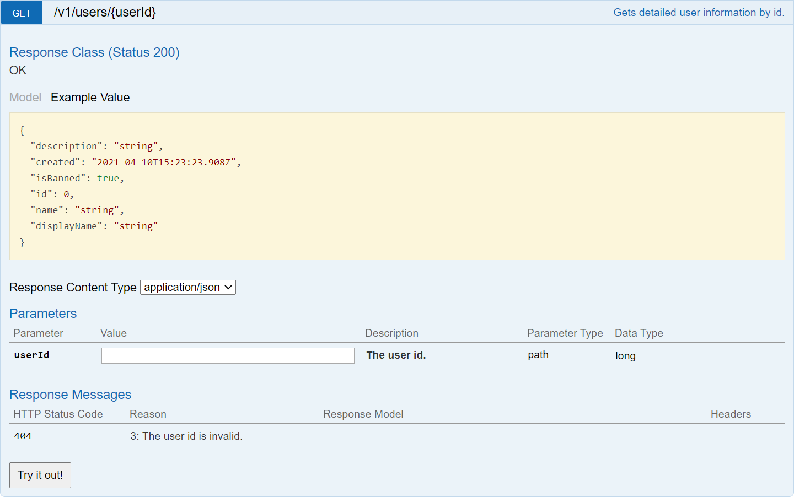
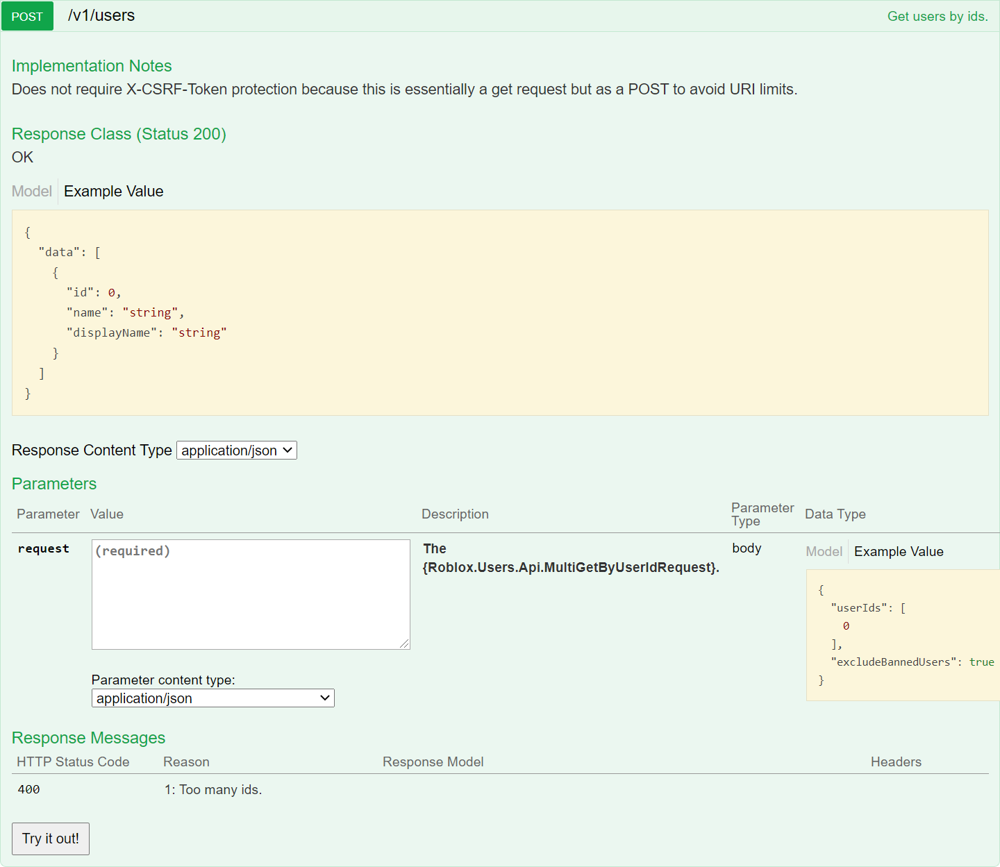

# Understanding documentation
Each documentation page contains a list of public endpoints available on that domain and information about how to use them.

## Accessing documentation
The Roblox API is broken down into **services**, like `users`, `groups`, and `friends`. In general, each service has
endpoints that generally involve one main concept, like "user information" or "friend management".

Each service has a separate subdomain on `roblox.com`, like `users.roblox.com` or `friends.roblox.com`.
The documentation for that service is available via the `/docs` route, like https://users.roblox.com/docs. 
Not all services have available documentation, and not all endpoints on those services are visible.

To find the service you need, see [List of services](../list-of-services.md). <!-- TODO: create this article -->

## Endpoint documentation

Documentation for all types of requests will always contain the following:  

- The text in top left corner and the background color differ depending on the method of the request.
- **Example Value** contains an example of what the response from this endpoint might look like.
- **Response Content Type** determines what should be passed to the `Accept` header.
  Usually you'll want this to be `application/json`.
- **Parameters** determines what data is passed to the endpoint when sending the request. 
  The **Parameter Type** determines how the parameter will be passed to the endpoint, like as a query string or 
  as a part of the URL.
- **Response Messages** explain what different endpoint status codes mean when they are returned from this endpoint.
- The "Try it out!" button sends a request to this endpoint with the specified parameters.

Requests with a body, like POST, PUT, PATCH, and DELETE, have an additional parameter labelled `request` which contains
the request body.

You can also change the body's content type. In almost all cases this should remain set to `application/json`. 
The "Example Value" contains an example of the data you should provide in the request body.
Clicking on that Example Value will set the body to the example data.
This is useful for quickly testing an endpoint before implementing it into your program.
